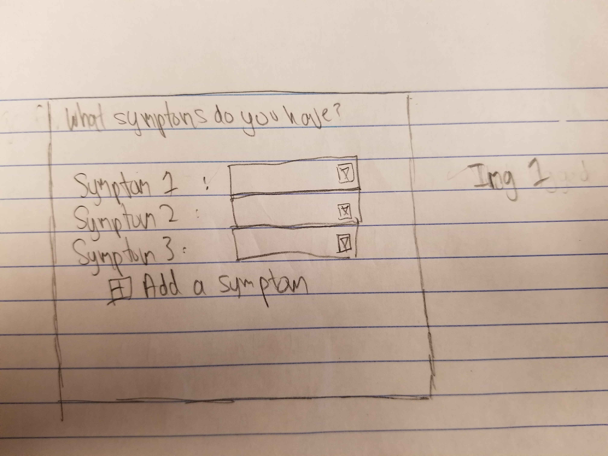
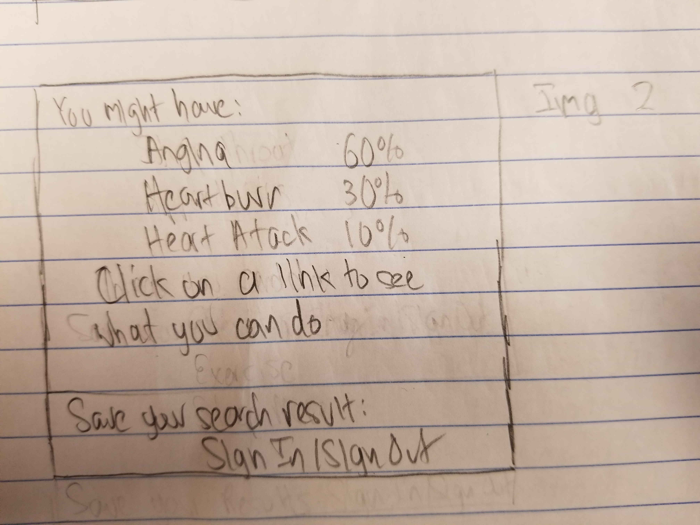
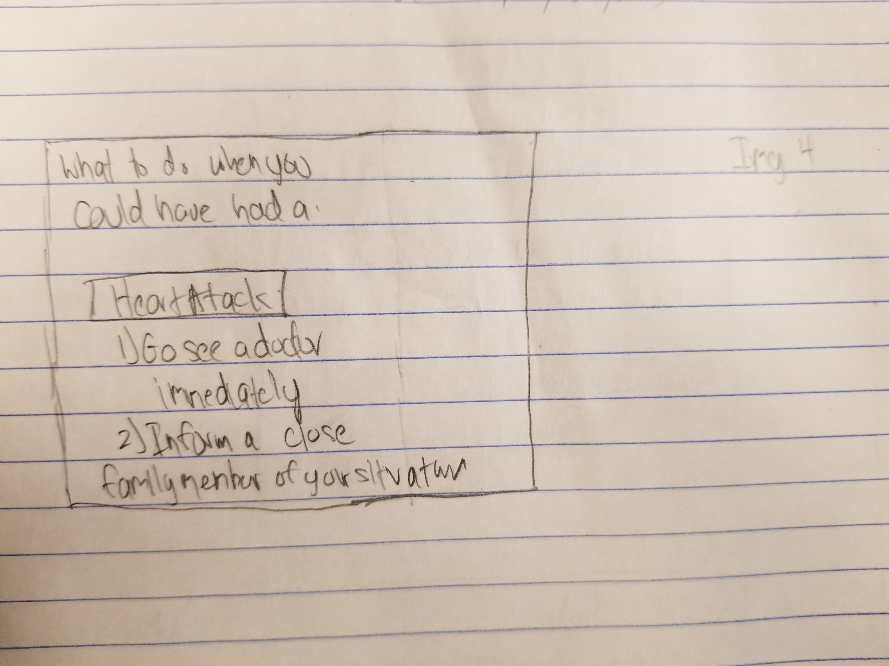
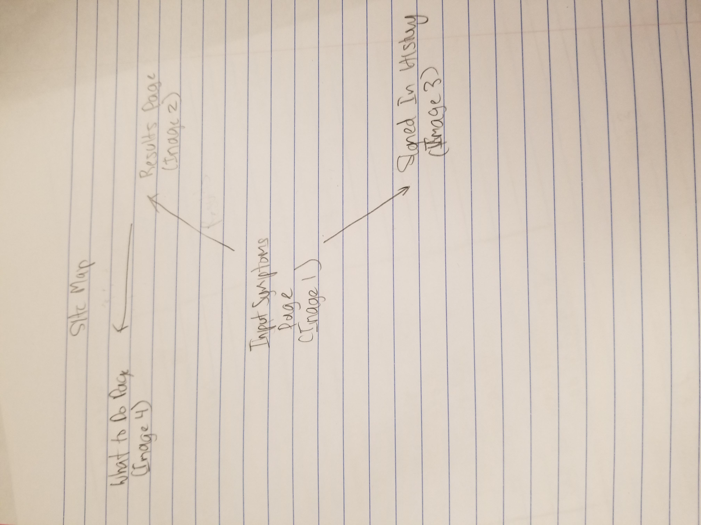

The content below is an example project proposal / requirements document. Replace the text below the lines marked "__TODO__" with details specific to your project. Remove the "TODO" lines.

(___TODO__: your project name_)

# Do You Have Cold?

## Overview

(___TODO__: a brief one or two paragraph, high-level description of your project_)

Using smart algorithms, 'Do you have a cold?' determines if you are sick, and gives you the proper ways to over your cold. 

## Data Model

(___TODO__: a description of your application's data and their relationships to each other_) 

The application will store Users 

* Users will have user and password 
* savedRecommendations will have a list of all the recommendations users make. 
* Feedback will have a list of all the feedback users make.  

(___TODO__: sample documents_)

An Example Users:

```javascript
{
  username: "person1",
  password: a password,
}
```

An Example of Recommendations:

```javascript
{
  Recommendations: String
}
```

An Example of Recommendations:

```javascript
{
  Feedback: String
}
```

## [Link to Commented First Draft Schema](db.js) 

(___TODO__: create a first draft of your Schemas in db.js and link to it_)


## Wireframes

(___TODO__: wireframes for all of the pages on your site; they can be as simple as photos of drawings or you can use a tool like Balsamiq, Omnigraffle, etc._)

Image 1 - page for entering symptoms in forms 



Image 2 - page for showing the results for possibly diseases



Image 3 - page for showing history for a authenticated user


Image 4 - page for showing Treatment ways



## Site map

(___TODO__: draw out a site map that shows how pages are related to each other_)



## User Stories or Use Cases

(___TODO__: write out how your application will be used through [user stories](http://en.wikipedia.org/wiki/User_story#Format) and / or [use cases](https://www.mongodb.com/download-center?jmp=docs&_ga=1.47552679.1838903181.1489282706#previous)_)

1. as non-registered user, I see what disease my symptoms most closely relate to
2. as non-registered user, I can see what I can do to treat my disease
3. as a user, I can log in to the site
3. as a user, I see my search results history 

## Research Topics

(___TODO__: the research topics that you're planning on working on along with their point values... and the total points of research topics listed_)

* (5 points) Integrate user authentication
    * I'm going to be using passport for user authentication
    * Be able to sign users up, save their hashed password/users
    * Be able to report error if invalid user/password


8 points total out of 8 required points (___TODO__: addtional points will __not__ count for extra credit_)


## [Link to Initial Main Project File](app.js) 

(___TODO__: create a skeleton Express application with a package.json, app.js, views folder, etc. ... and link to your initial app.js_)


## Annotations / References Used

(___TODO__: list any tutorials/references/etc. that you've based your code off of_)

1. [passport.js authentication docs](http://passportjs.org/docs) - (add link to source code that was based on this)
2. [tutorial on fuse.js](https://github.com/krisk/fuse) - (add link to source code that was based on this)


Some research thoughts on fuse.js and other input validation libraries:

My research is to look for possible ways to implement filling in the submit button for symptoms. I looked into fuse.js, which helps to return things from the database even if the search strings are incorrect. However, I was also looking into Parsley, which is for validation. One prevents inputs, the other accepts any input and tries to do something with it. I'm not sure what I want to do, but it seems that fuse.js seems more forgiving for the user. In addition, fuse.js does not need any dependencies, which make it more lightweight and perhaps easier to integrate. 

Plan to use something similar to this regex: 
onst SPECIAL_CHARS_REGEX = /[\-\[\]\/\{\}\(\)\*\+\?\.\\\^\$\|]/g

module.exports = (text, pattern, tokenSeparator = / +/g) => {
  let regex = new RegExp(pattern.replace(SPECIAL_CHARS_REGEX, '\\$&').replace(tokenSeparator, '|'))
  let matches = text.match(regex)
  let isMatch = !!matches
  let matchedIndices = []

  if (isMatch) {
    for (let i = 0, matchesLen = matches.length; i < matchesLen; i += 1) {
      let match = matches[i]
      matchedIndices.push([text.indexOf(match), match.length - 1])
    }
  }

  return {
    // TODO: revisit this score
    score: isMatch ? 0.5 : 1,
    isMatch,
    matchedIndices
  }
}

But after some more research, I decided to do more than just have a drop down or regex matcher. I decided to do form validation, because I think it is easier to do. I decided to go with validate.js, because not only does it provide regex matching, but also integrates easily with multiple forms and the database. An example of a constructor of a New Form Validator can be used here.

var validator = new FormValidator('example_form', [{
    name: 'req',
    display: 'required',
    rules: 'required'
}, {
    name: 'alphanumeric',
    rules: 'alpha_numeric'
}, {
    name: 'password',
    rules: 'required'
}, {
    name: 'password_confirm',
    display: 'password confirmation',
    rules: 'required|matches[password]'
}, {
    name: 'email',
    rules: 'valid_email',
    depends: function() {
        return Math.random() > .5;
    }
}, {
    name: 'minlength',
    display: 'min length',
    rules: 'min_length[8]'
}], function(errors, event) {
    if (errors.length > 0) {
        // Show the errors
    }

The errors also are like AJAX, where form validation occurs if any of the fields are either not filled in properly or like if its not a number. This means, there's no need to refresh the page, and makes the experience more seamless. 

The webpage is : http://rickharrison.github.io/validate.js/


